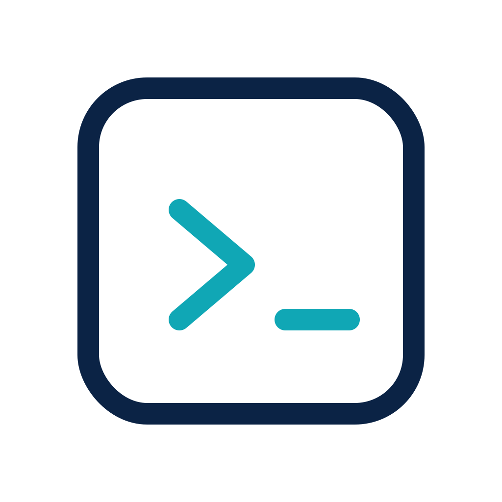

# Devbox

<p align="center">
  
</p>

<p align="center">
  A ready-to-use Linux container for agent-driven development.
</p>

## What's included

- Ubuntu 26.04
- SDKMAN!
- Node.js
- OpenCode

## Install

### POSIX shells

```sh
curl -fsSL https://raw.githubusercontent.com/alexandru/devbox/main/install.sh | sh
```

### PowerShell

```powershell
irm https://raw.githubusercontent.com/alexandru/devbox/main/install.ps1 | iex
```

## Use

Requires Docker, Podman, or `wslc`.

```sh
devbox start /path/to/project
devbox shell
```

## Image

```text
ghcr.io/alexandru/devbox:latest
```
