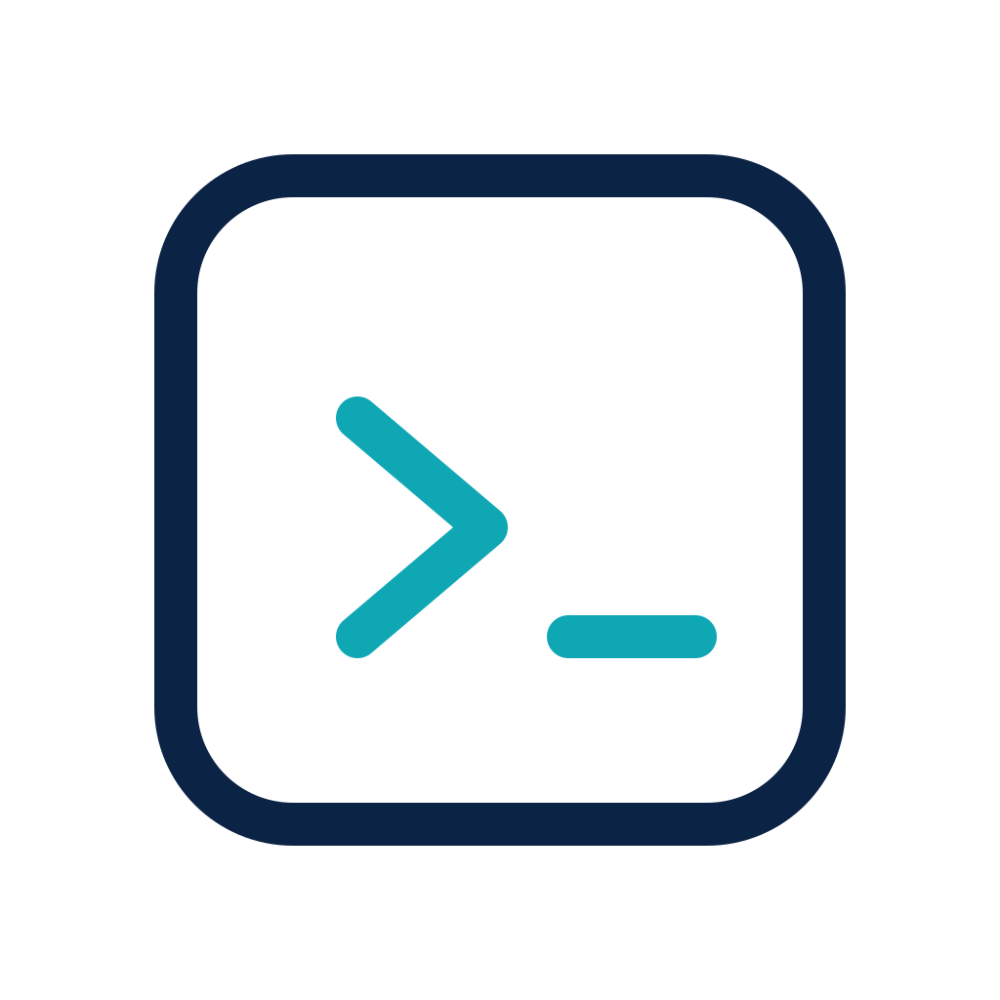

# Devbox



A ready-to-use Linux container for agent-driven development, with a launcher provided for efficient setup and interactions with the container.

- Ubuntu 26.04
- SDKMAN!
- Node.js
- OpenCode v1 (`opencode`) and v2 (`opencode2`)

## Install

[devbox](./bin/devbox) script is supported on Linux, MacOS and Windows.

### POSIX shells

```sh
curl -fsSL https://raw.githubusercontent.com/alexandru/devbox/main/install.sh | sh
```

### PowerShell

```powershell
irm https://raw.githubusercontent.com/alexandru/devbox/main/install.ps1 | iex
```

## Use

Requires Docker, Podman, or [wslc](https://learn.microsoft.com/en-us/windows/wsl/tutorials/wsl-containers?source=recommendations).

```sh
# Starts the container, mounting ~/Projects in it
# (this being the "workspace" that contains projects of interest)
devbox start ~/Projects

# Opens a shell that chdirs straight in a desired project's path
devbox shell ~/Projects/path/to/project
```

### Custom mounts

`start` and `compose` accept repeatable `--mount HOST:CONTAINER[:OPTIONS]` bind mounts.
Each host source must already exist; it may be a file or directory. Container targets must
be explicit absolute Linux paths. `~` is not expanded in `--mount` values.

```sh
# POSIX: mount a read-only local file below the dev home directory
devbox start --mount /Users/alex/.config/tool/config.toml:/home/dev/.config/tool/config.toml:ro /Users/alex/Projects
```

```powershell
# Windows: mount an existing directory; quote paths containing spaces
devbox start --mount 'C:\Users\Alex\Secrets:/home/dev/secrets:ro' 'C:\Users\Alex\Projects'
```

Changing requested custom mounts for an existing container requires `devbox purge` before
starting again.

### Environment forwarding

Every valid non-reserved `DEVBOX_*` variable is forwarded into the container with its
`DEVBOX_` prefix removed, including empty values. For example, `DEVBOX_OPENAI_API_KEY`
becomes `OPENAI_API_KEY`, and `DEVBOX_NAME` becomes `NAME`. Launcher controls listed by
`devbox help-env` are not forwarded: `DEVBOX_IMAGE`, `DEVBOX_AGENT_PORT`,
`DEVBOX_HOME_VOLUME`, `DEVBOX_HOME_VOLUME_PREFIX`, `DEVBOX_WIREGUARD_CONFIG_PATH`,
`DEVBOX_WIREGUARD_CONFIG_STR`, and `DEVBOX_WIREGUARD_MTU`. Compose output references
source variable names and does not embed their values.

`DEVBOX_AUTH_*` no longer receives special handling. Rename variables such as
`DEVBOX_AUTH_OPENAI_API_KEY` to `DEVBOX_OPENAI_API_KEY`. `DEVBOX_OPENCODE_CONFIG_DIR` is
also an ordinary forwarded variable; it does not create a mount.

For configuring the `devbox` script see the available env variables that it can use:

```sh
devbox help-env
```

For example, you can use 1Password CLI and supply secrets to `devbox` via a helper script like this:

```sh
#!/usr/bin/env bash

# Retrieving secrets from 1Password because keeping secrets in files is not OK
OP_BIN="$(which op)"
if [[ -z "$OP_BIN" ]]; then
  OP_BIN="$(which op.exe)"
fi
if [[ -z "$OP_BIN" ]]; then
  echo "1Password CLI (op) not found. Please install it and sign in."
  exit 1
fi

# What container CLI tools to use, valid choices are: wslc, podman, docker
# Forcing `podman`; if not provided, defaults to whatever it finds 
# (wslc, docker, podman in this order)
export CONTAINER_CLI="podman"

# Set the OpenCode API key for authentication
# (optional, OpenCode can be configured manually from a shell)
export DEVBOX_OPENCODE_API_KEY="$("$OP_BIN" read op://Private/OpenCode/Api/Personal)"

# Set the Wireguard VPN configuration (optional, VPN is not required)
export DEVBOX_WIREGUARD_CONFIG_STR="$("$OP_BIN" read op://Private/VPN/notesPlain)"

exec devbox "$@"
```
